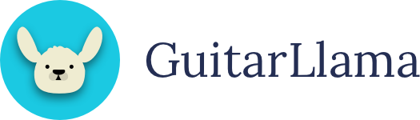

# GuitarLlama | Fretboard Memorizer



**GuitarLlama | Fretboard Memorizer** is a high-fidelity, neural instrument trainer designed to help guitarists master the fretboard with surgical precision. Unlike traditional quiz apps, it listens to your **real guitar** through your microphone and uses a custom-built neural spaced-repetition engine to optimize your memorization.

## 🚀 Key Features

### 🧠 Neuro-Logic SRS Engine
Master the neck faster using our advanced **Spaced Repetition System (SRS)**. The engine tracks your stability, response time (latency), and accuracy for every single fret across all 6 strings. It intelligently prioritizes your "blind spots" without repeating the same note name twice in a row.

### 🎸 Neural Pitch Detection
Built with a highly-tuned autocorrelation algorithm, the engine is **Octave-Aware**. It distinguishes between your Low E (6th string) and High E (1st string), ensuring you aren't just learning note names, but absolute fret positions.

### 🎯 Training Scopes
Tailor your session to your current skill level:
*   **Fret Span**: Focus on specific areas (e.g., Frets 0-5 for beginners, or 12-22 for advanced mastery).
*   **Natural Notes Only**: Master the core naturals before introducing accidentals (#/b).
*   **String Selection**: Isolate individual strings or practice across the entire set.

### ⚡ Interactive Auto-Calibration
Set up your perfect audio pipeline in seconds. The 3-step calibration flow establishes your room's noise floor and verifies your instrument's range (Low E to High E), automatically setting your optimal Mic Gain and Noise Gate.

### 🗺️ Mastery Heatmap
Visualize your progress with an interactive heatmap overlay. Watch your fretboard turn from "Learning Red" to "Mastered Green" as your neural stability increases.

---

## 🛠️ Tech Stack

*   **Framework**: [Next.js 15+](https://nextjs.org/) (App Router)
*   **Language**: [TypeScript](https://www.typescriptlang.org/)
*   **Styling**: [Tailwind CSS v4](https://tailwindcss.com/)
*   **Audio**: Web Audio API (Native Autocorrelation)
*   **Testing**: [Vitest](https://vitest.dev/) & React Testing Library

---

## 💻 Getting Started

### Prerequisites
*   Node.js 22+
*   Volta (Recommended for version locking)

### Installation
1. Clone the repository
2. Install dependencies:
   ```bash
   npm install
   ```
3. Run the development server:
   ```bash
   npm run dev
   ```
4. Open [http://localhost:3000](http://localhost:3000) and grant microphone permissions to begin.

---

## 🌐 SEO & Ranking
This application is optimized to be the #1 **guitar fretboard memorization app**.
*   **Keywords**: guitar fretboard memorization app, guitar fret note memorizer app, learn guitar notes, fretboard trainer, guitar neck master.

---

## 📄 License
Part of the **GuitarLlama** ecosystem. All rights reserved.
